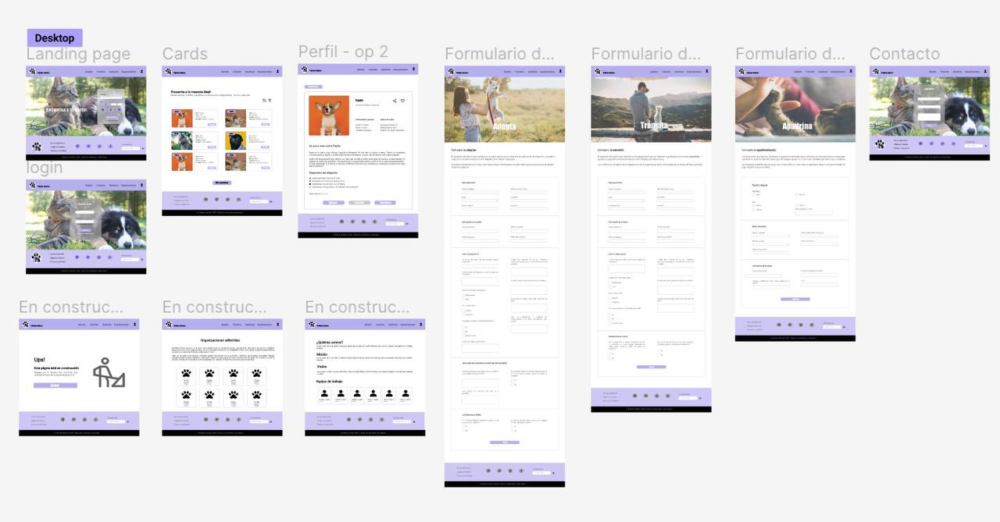

<h1 align="center">PATITAS FELICES </h1>

# 🐾 – Frontend

Interfaz web del proyecto **Patitas Felices**, construida con **HTML, CSS y JavaScript**, que consume la API backend desplegada con Flask.  
El frontend está alojado en **Netlify** y se conecta con el backend para mostrar y gestionar información de mascotas.  
🔗 https://patitas-felices-mascotas.netlify.app

---

## 🧠 Descripción del proyecto

Este repositorio contiene el frontend de una aplicación web diseñada para gestionar un registro de mascotas.  
La interfaz fue creada con HTML, CSS y JavaScript y se comunica con el backend usando **fetch API** para obtener, crear, actualizar y eliminar mascotas.

El objetivo es brindar una experiencia intuitiva y funcional usando tecnologías web básicas con integración a un backend real.

---

## 🛠️ Tecnologías y herramientas utilizadas

**Lenguajes**

- HTML
- CSS
- JavaScript (ES6+)

**Herramientas**

- Fetch API para consumo de datos
- Control de versiones con Git y GitHub
- Netlify para deploy y hosting

---

## 🚀 Deploy en producción

🔗 **Frontend en Netlify:**  
https://patitas-felices-mascotas.netlify.app

Este frontend está configurado para consumir la API backend desplegada en Python + Flask.

---

## 📦 Instalación y uso

No necesitás instalar nada si solo querés **visualizar la app**, ya que está desplegada.  
Pero si querés correrla localmente:

1. **Clonar este repositorio**

```bash
git clone https://github.com/SHA-Arg/TP-Codo-a-Codo-DesarrolloWeb-Mascotas.git
cd TP-Codo-a-Codo-DesarrolloWeb-Mascotas
```

Abrir el archivo index.html en tu navegador.
Simplemente hacé doble click o abrilo desde tu editor favorito.

🔌 Conexión con el Backend

El frontend hace requests a la API para obtener y administrar datos de mascotas.

Ejemplo de uso de Fetch API:

```bash
fetch("https://s3b4.pythonanywhere.com/mascotas")
  .then(res => res.json())
  .then(data => {
    // Procesa los datos y actualiza la UI
  })
  .catch(error => console.error(error));
```

📂 Estructura del proyecto

```text
PatitasFelices-Frontend/
               ├── css/
               │   └── styles.css        # Estilos
               ├── js/
               │   └── main.js           # Lógica de interacción y fetch API
               ├── index.html            # Interfaz principal
               ├── README.md             # Documento de este repositorio
               └── assets/               # Imágenes y recursos gráficos
```

🎯 Funcionalidades destacadas

✔️ Listado de mascotas
✔️ Formularios para agregar nuevas mascotas
✔️ Posibilidad de modificar o eliminar mascotas (según la API)
✔️ Interacción completa con el backend usando Fetch API

📌 Cómo probarlo localmente

Abre index.html en tu navegador.

Asegurate de tener el backend corriendo (o apunta a la URL pública).

Interactúa con la interfaz para ver, agregar o eliminar mascotas.

🧠 Aprendizajes

Este proyecto te permite demostrar:

✔️ Integración frontend–backend con Fetch API
✔️ Uso de JavaScript para manejo de datos
✔️ Maquetación web con HTML & CSS
✔️ Despliegue de un sitio estático en Netlify
✔️ Buenas prácticas de estructura y orden de archivos

## 📸 Capturas

## Mobile


## Desktop



👤 Autores
Andrea Jiménez Espinoza
🔗 https://github.com/andreajimeneze

Sofía Egaña Jiménez
🔗 https://github.com/SofiaInSilico

Sebastian Hereñu Amaral
🔗 https://github.com/SHA-Arg

🌐 Portfolio: https://sha-arg.github.io

Edson Yañez
🔗 https://github.com/edson-yanez-villa

## Organizaciones de rescate animal (perfiles de Instagram):

### En Argentina:

Mascotas en adopción:
https://instagram.com/mascotasenadopcionargentina?igshid=MzRlODBiNWFlZA==

Proyecto4patas:
https://instagram.com/proyecto4patas?igshid=MzRlODBiNWFlZA==

Huéllelas perdidas:
https://instagram.com/huellitasperdidasok?igshid=MzRlODBiNWFlZA==

Pichichos al rescate:
https://instagram.com/pichichosalrescate?igshid=MzRlODBiNWFlZA==

Refugio el campito:
https://instagram.com/refugioelcampito?igshid=MzRlODBiNWFlZA==

Los hermanos Paticorti:
https://instagram.com/loshermanospaticorti?igshid=MzRlODBiNWFlZA==

Refugio Soplo de Vida:
https://instagram.com/soplodevida_?igshid=MzRlODBiNWFlZA==

Gatitos parque chacabuco:
https://instagram.com/gatitos_parque_chacabuco?igshid=MzRlODBiNWFlZA==

Patitas al rescate:
https://instagram.com/patitasalrescate?igshid=MzRlODBiNWFlZA==

Fundación orejas:
https://instagram.com/fundacionorejas?igshid=MzRlODBiNWFlZA==

Adopciones quilmes:
https://instagram.com/adopcionesquilmes?igshid=MzRlODBiNWFlZA==

Rescataditos en adopción: https://instagram.com/rescataditosenadopcionn?igshid=MzRlODBiNWFlZA==

Hogar corazón animal:
https://instagram.com/hogarcorazonanimal?igshid=MzRlODBiNWFlZA==

Refugio San Roque:
https://instagram.com/refugiosanroque?igshid=MzRlODBiNWFlZA==

Fundación Bicho Feliz:
https://instagram.com/holabichofeliz?igshid=MzRlODBiNWFlZA==

Adopta un Galgo:
https://instagram.com/adoptaungalgo?igshid=MzRlODBiNWFlZA==

Refugio San Francisco de Asís:
https://instagram.com/refuasis?igshid=MzRlODBiNWFlZA==

Perros del alma:
https://instagram.com/perrosdelalma?igshid=MzRlODBiNWFlZA==

Adoptá un Callejeritx:
https://instagram.com/adoptauncallejeritx_?igshid=MzRlODBiNWFlZA==

Adopta perros BA:
https://instagram.com/adoptaperrosba?igshid=MzRlODBiNWFlZA==

El paraíso de los animales (santuario):
https://instagram.com/elparaisoanimaloficial?igshid=MzRlODBiNWFlZA==

Refugio de lactantes:
https://instagram.com/refugiodelactantes?igshid=MzRlODBiNWFlZA==

Huellitas adopciones:
https://instagram.com/huellitas.adopciones?igshid=MzRlODBiNWFlZA==

Compromiso inflamable:
https://instagram.com/compromisoinflamable?igshid=MzRlODBiNWFlZA==

Fauna urbana:
https://instagram.com/faunaurbanaba?igshid=MzRlODBiNWFlZA==

Mascotas puerto Madero:
https://instagram.com/mascotaspuertomadero?igshid=MzRlODBiNWFlZA==

Adopciones responsables:
https://instagram.com/adopciones_caba?igshid=MzRlODBiNWFlZA==

Productos solidarios mascotas:
https://instagram.com/productosolidariosparamascotas?igshid=MzRlODBiNWFlZA==

Salvando patitas:
https://instagram.com/salvandoopatitas?igshid=MzRlODBiNWFlZA==

Refugio mia:
https://instagram.com/refugio.mia?igshid=MzRlODBiNWFlZA==

Proyecto hocicos contentos:
https://instagram.com/proyecto.hocicos.contentos?igshid=MzRlODBiNWFlZA==

Adopción perros y gatos:
https://instagram.com/adopcion.perros.y.gatos?igshid=MzRlODBiNWFlZA==

Team ratas:
https://instagram.com/teamratas.ong?igshid=MzRlODBiNWFlZA==

Rescatando huellitas:
https://instagram.com/1__rescatando_huellitas_?igshid=MzRlODBiNWFlZA==

Perros con calle:
https://instagram.com/perrosconcalle?igshid=MzRlODBiNWFlZA==

Fundación mi mejor amigo:
https://instagram.com/fundacion_mimejoramig0?igshid=MzRlODBiNWFlZA==

Cambiando vidas Carmen de Areco:
https://instagram.com/cambiandovidas.ar?igshid=MzRlODBiNWFlZA==

Chicas al rescate:
https://instagram.com/chicas_al_rescate?igshid=MzRlODBiNWFlZA==

### En Chile:

Fundación Animalia:
https://instagram.com/fundacionanimalia?igshid=MzRlODBiNWFlZA==

AnimalParaiso:
https://instagram.com/animalparaiso?igshid=MzRlODBiNWFlZA==

Cachupines UCN:
https://instagram.com/cachupinesucn?igshid=MzRlODBiNWFlZA==

Huellas abandonadas:
https://instagram.com/huellas.abandonadas?igshid=MzRlODBiNWFlZA==

Fundación puerto mascotas:
https://instagram.com/puertomascotas?igshid=MzRlODBiNWFlZA==

Adopta V región:
https://instagram.com/adopta.vregion?igshid=MzRlODBiNWFlZA==

### En España:

Asociación protectora de animales anaa:
https://instagram.com/asociacion_anaa?igshid=MzRlODBiNWFlZA==

Refugio puro amor:
https://instagram.com/refugiopuroamor?igshid=MzRlODBiNWFlZA==

### En México:

Zadrigman:
https://instagram.com/zadrigman?igshid=MzRlODBiNWFlZA== -->
